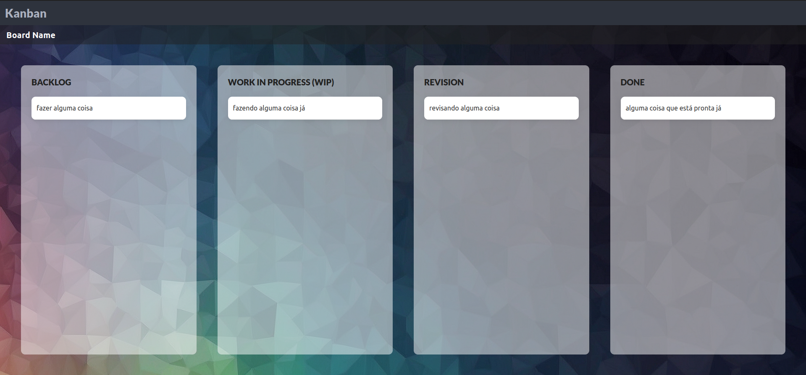
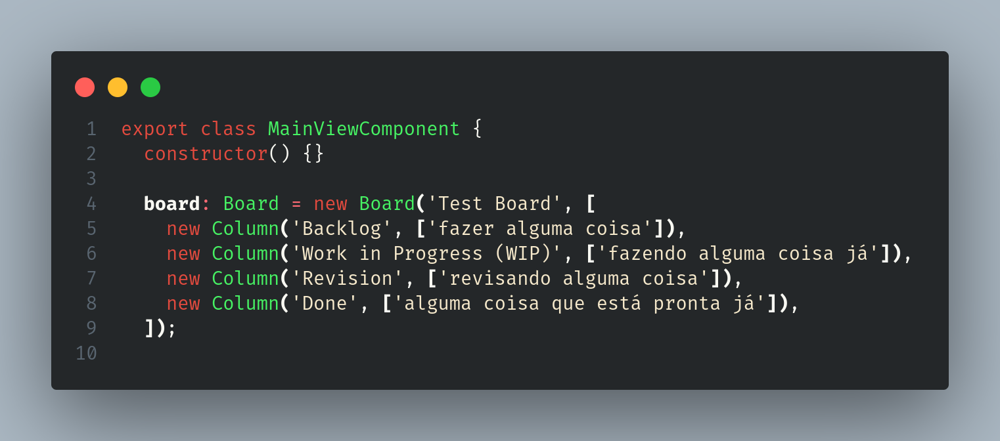

# Kanban

Olá! Esse projeto é um Kanboard Web, feito com Angular e baseado [nesse vídeo](https://www.youtube.com/watch?v=YGCDAXFWAZo) do canal [DevStackr](https://www.youtube.com/@Devstackr).

Resumo das funcionalidades do projeto:

- Todas as informações do Board são dinâmicas
  - ele está pronto para receber dados de uma api, com classes e modelos para os dados, embora os dados ainda estejam sendo passados na mão mesmo, de forma estática.
- Todas as tasks usam o [CDK](https://v7.material.angular.io/cdk/drag-drop/overview) do Angular, então são todas arrastáveis
- O css foi feito parte usando a biblioteca [Bulma](https://bulma.io/documentation/start/overview/) e parte na mão

Coisas que ainda podem ser feitas:

- [ ] Adicionar um banco de dados sql pra permanência dos dados
- [ ] Adicionar formas de editar as informações do Board
- [ ] Adicionar formas de mudar o board atual, criar novos etc.
- [ ] Fazer CRUDs (pra quase tudo rs)
- [ ] Criar páginas para melhor exibição de uma task
- [ ] Melhorar responsividade

Parte do código dentro da classe principal:

Espero poder concluir parcial ou completamente essas coisas que ficaram faltando.
